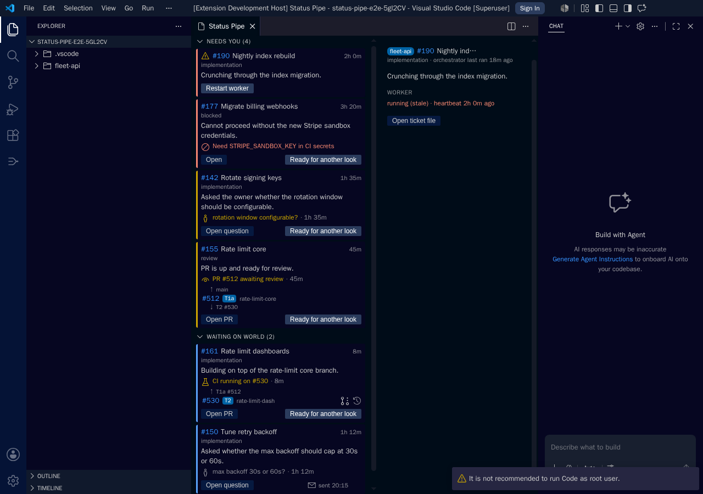
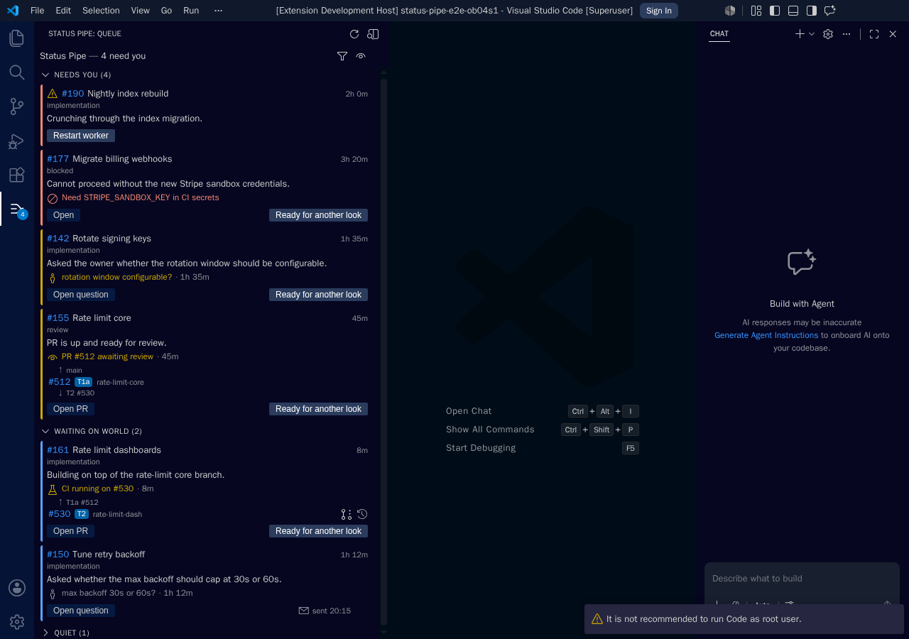
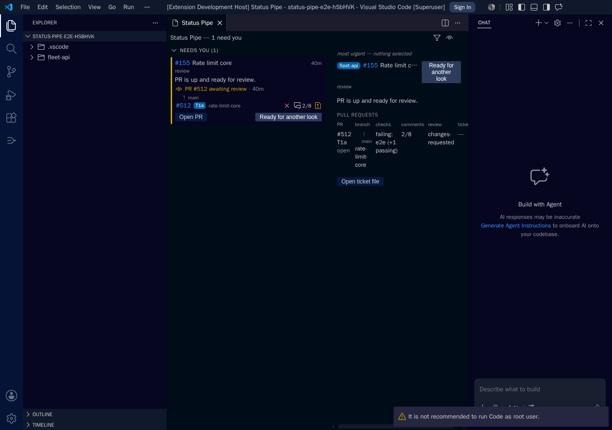
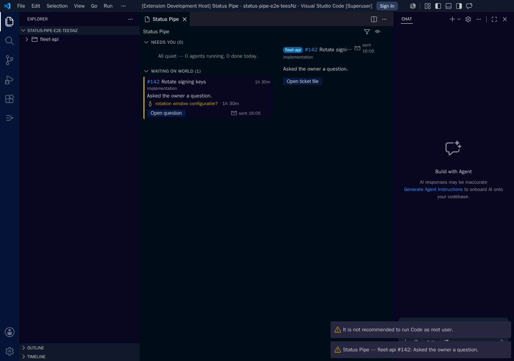
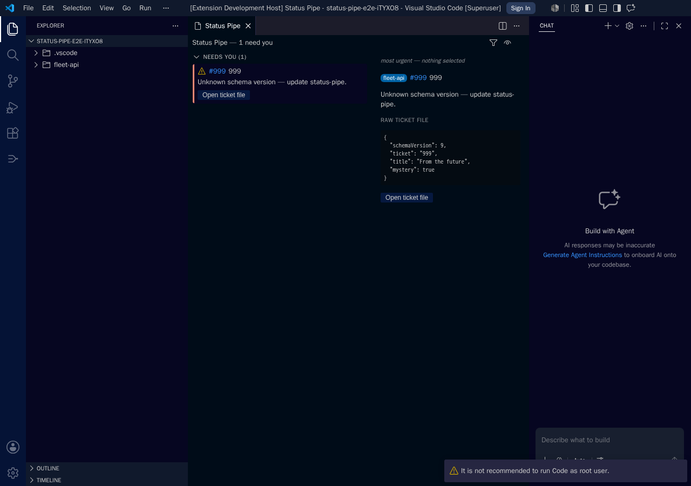
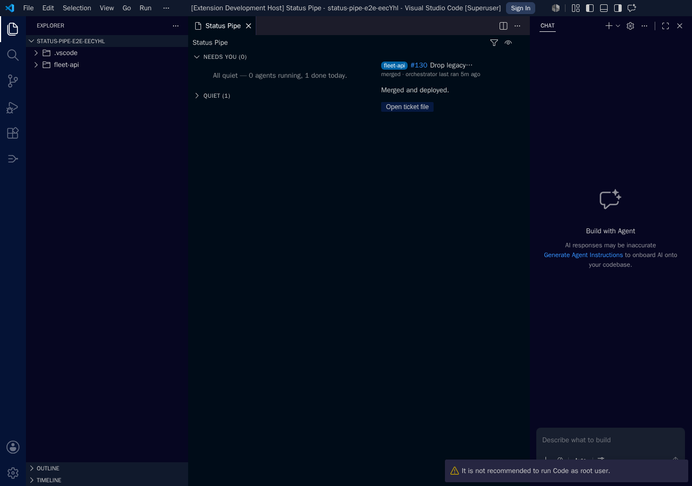

# status-pipe

A VS Code extension that gives a human operator a **review/response queue** over
a fleet of autonomous coding agents, plus a Claude Code plugin providing the
baseline agent workflow that feeds it.

Agents publish state as JSON files under `.status-pipe/` in each repo;
status-pipe watches those files across the workspace, enriches them with live
forge data (GitHub or Bitbucket Cloud + Jira Cloud), and renders a prioritized
queue of what needs the operator — blockers, design questions, review requests,
merges — alongside everything quietly in flight. The operator hands work back
to agents with a one-click **"Ready for another look"** signal, and in fleet
mode the extension launches and supervises the per-repo agent loops itself.

## Parts

| Path | What it is |
|---|---|
| `src/` | The extension: protocol reader/watcher, queue model, forge enrichment (GitHub GraphQL / Bitbucket REST, rate-budget-aware caching), agent supervisor, React webview (tray + editor tab) |
| `plugin/` | The `status-pipe` Claude Code plugin: `/status-pipe:tick`, `work-ticket`, `work-epic`, `launch`, `split`, `ack-check`, the trust-gateway and attribution `bin/` scripts, and the binding protocol skill |
| `schemas/` | JSON Schemas for the protocol files (`ticket`, `ack`, `launch`, `orchestrator`, `config`) — one contract shared by extension and plugin |
| `design/` | The design documents (01–10) and SVG wireframes; `design/02-protocol.md` is the protocol spec, `design/10-naming.md` the terminology decision record |

## The protocol in one breath

`.status-pipe/` at each repo root: committed `launch.json` (how to start the
agent loop) and `config.json` (epics dir, ticketing source, trust mode,
attribution); gitignored `tickets/<key>.json` (agent-owned work-item state),
`orchestrator.json` (pass metadata + parking), and `inbox/<ticket>/ack-*.json`
(operator → orchestrator signals, the one thing the extension writes). Full
spec: [design/02-protocol.md](design/02-protocol.md).

## What it looks like

These images are the **checked-in Playwright snapshot baselines** — every CI
run re-renders the real extension inside headless VS Code and pixel-compares
against them, so what you see here is what the code actually produces.

### The queue as an editor tab

Lanes (NEEDS YOU / WAITING / QUIET), priority ordering, stack indicators, and
worker status — [queueLanes.spec.ts](src/test/e2e/playwright/queueLanes.spec.ts):



### The compact tray view

The same queue as a side-bar triage index:



### Forge enrichment badges

CI state, comment counts, and review decisions served by the in-process fake
forge — [enrichedBadges.spec.ts](src/test/e2e/playwright/enrichedBadges.spec.ts):



### The ack flow

After clicking **Ready for another look** the chip appears and the ack file is
asserted on disk with the protocol-correct id —
[ackFlow.spec.ts](src/test/e2e/playwright/ackFlow.spec.ts):



### Degraded and quiet states

A ticket from an unknown future schema renders a degraded card (never hidden),
and an empty needs-you lane renders the product sentence:





To regenerate after an intentional UI change, run
`npm run test:e2e:playwright:docker:update` locally and commit the PNGs (amd64
via OrbStack/Rosetta — byte-identical to the CI oracle). CI only verifies; it
never regenerates baselines.

## Installing from source

The extension is not on the marketplace yet; build and install the `.vsix`
yourself:

```sh
git clone https://github.com/irl-llc/status-pipe.git
cd status-pipe
npm install
npm run package:vsix     # produces status-pipe-<version>.vsix
code --install-extension status-pipe-*.vsix
```

(Or in VS Code: Extensions view → `…` menu → **Install from VSIX…** and pick
the file.) The packaged extension activates when a `.status-pipe/` directory
exists anywhere under a workspace folder. To use the companion Claude Code
plugin from source, see [plugin/README.md](plugin/README.md).

## Standalone CLI (no VS Code)

For CI, cron, and headless servers, `status-pipe` runs one planner pass
(reconcile → dispatch → report) over a repo's `.status-pipe/` state with no
extension installed — the same planner core the extension runs in-process.

A self-contained single-file binary is attached to each
[release](https://github.com/irl-llc/status-pipe/releases) (linux/macOS/windows ×
x64/arm64) and needs **no preinstalled Node** — drop it on PATH and run:

```sh
status-pipe tick                 # one planner pass over the current repo
status-pipe tick --json          # machine-readable PlanResult
status-pipe --help
```

GitHub auth is resolved from `GITHUB_TOKEN`/`GH_TOKEN`, else `gh auth token`,
else the git credential helper (never from committed config). Exit codes:
`0` success · `1` runtime error or trust refusal · `2` usage error.

Prefer npm? `npm i -g status-pipe` installs the same CLI (needs Node). Build the
binary yourself with `npm run build:binary` (requires an official nodejs.org
Node — Homebrew's omits the SEA fuse).

## Development

```sh
npm install
npm run compile          # webpack both bundles
npm run test:unit        # mocha unit suite (run compile-tests first)
npm run test:e2e:docker  # @vscode/test-cli suite, headless in Docker
npm run test:e2e:playwright:docker   # visual snapshots (Linux baseline)
```

Releases are automated: changie fragments per PR → scheduled auto-release →
marketplace publish. See [CONTRIBUTING.md](CONTRIBUTING.md).

Repository: https://github.com/irl-llc/status-pipe · Publisher: `IRLAILLC`
